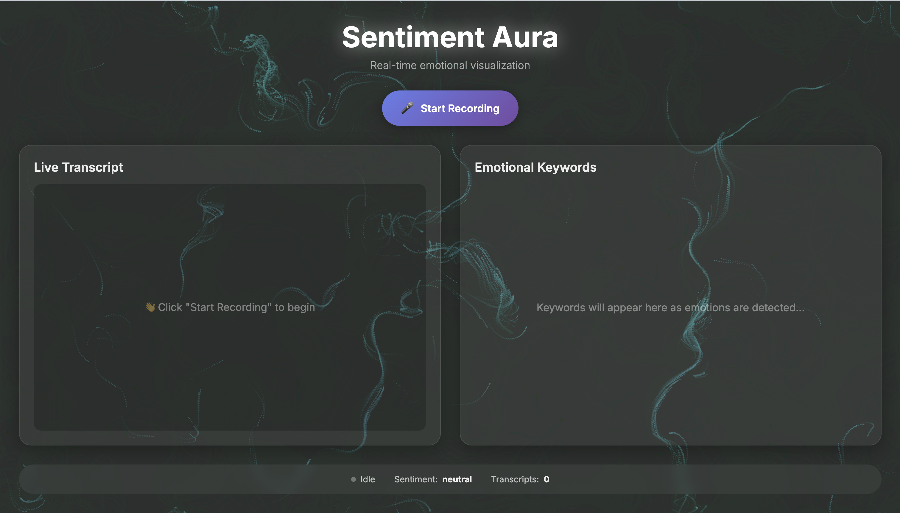

<h1 align="center">Sentiment Aura</h1>

<p align="center">
  <strong>Real-time emotional visualization powered by AI sentiment analysis and generative art</strong>
</p>

<p align="center">
  
  
  
  
</p>

<p align="center">
  
</p>

---
**Sentiment Aura** is an AI-powered application that listens to live speech, analyzes emotional tone in real time, and transforms it into dynamic generative art.

Built end-to-end with **FastAPI, React, Vercel, Railway, OpenAI, Deepgram, and p5.js**.

🔗 **Live Demo**: [https://sentiment-aura-sigma.vercel.app](https://sentiment-aura-sigma.vercel.app)  
⚙️ **Backend API**: [https://sentiment-aura-backend-production.up.railway.app](https://sentiment-aura-backend-production.up.railway.app)

---

##  What This Project Demonstrates

This project showcases my ability to build and deploy a full-stack AI system with:

- **Real-time audio processing** (Web Audio API → Deepgram WebSockets)
- **AI-driven sentiment analysis** (OpenAI GPT-4o-mini)
- **Responsive generative visuals** (p5.js Perlin noise fields)
- **Cloud-native deployment** (Vercel + Railway)
- **Robust backend engineering** with FastAPI (async, CORS, error handling)
- **Secure environment variable setup** across local + production
- **Smooth interactive UI** with live state updates

---

##  Tech Stack

**Frontend:** React 18, Vite, p5.js, Web Audio API  
**Backend:** FastAPI, Python 3.9+, Uvicorn  
**AI & APIs:** Deepgram (speech-to-text), OpenAI GPT-4o-mini (sentiment)  
**Deployment:** Vercel (frontend), Railway (backend)

---

##  Features

- **Real-time Audio Transcription**: Live speech-to-text using Deepgram WebSocket with auto-scrolling display
- **AI Sentiment Analysis**: Emotion detection and keyword extraction powered by OpenAI GPT-4o-mini
- **Generative Art Visualization**: 800+ particles flowing through Perlin noise fields with 8 ribbon trails
- **Emotion-Driven Colors**: 
  - 😊 **Positive** → 🟠🟡 Warm oranges and yellows (sunrise vibes)
  - 😢 **Negative** → 🔵🟣 Dark blues and purples (midnight vibes)
  - 😐 **Neutral** → 🩵 Cyan and teal (ocean vibes)
- **Smooth Transitions**: Exponential color interpolation for seamless emotional shifts
- **Animated Keywords**: Emotional tags fade in gracefully with staggered timing (100ms delay)
- **Visual Effects**: Particle glows, pulsing center orb, and flowing gradient ribbons
- **Smart Parameter Mapping**: Intensity, energy, and complexity control particle speed, count, and flow
- **Real-time Status**: Live sentiment display, recording indicator, and transcript count
- **Robust Error Handling**: Graceful recovery from API delays and connection issues
- **Privacy-focused**: Audio processed in real-time, never stored
---

##  Architecture Overview

Sentiment Aura is built as a lightweight, real-time AI pipeline connecting four distinct services:
```text
┌──────────────────────────────────────────────────────────┐
│                  FRONTEND (React + Vite)                 │
├──────────────────────────────────────────────────────────┤
│ • Microphone capture (Web Audio API)                     │
│ • Audio streaming to Deepgram (WebSocket)                │
│ • Live transcript display                                │
│ • Sentiment requests to backend (HTTP POST)              │
│ • Real-time visualization updates (p5.js)                │
└────────┬──────────────────────────────┬─────────────────-┘
         │                              │
         │ Audio (WebSocket)            │ Text (HTTP POST)
         ↓                              ↓
┌────────────────────┐         ┌─────────────────────────┐
│  DEEPGRAM API      │         │   BACKEND (FastAPI)     │
│  (Transcription)   │         ├─────────────────────────┤
├────────────────────┤         │ • Input validation      │
│ • Speech-to-text   │         │ • OpenAI API proxy      │
│ • WebSocket stream │         │ • Response formatting   │
│ • Returns JSON     │         └──────────┬──────────────┘
│   transcript       │                    │
└────────────────────┘                    │ AI Request
                                          ↓
                              ┌────────────────────────┐
                              │   OPENAI API           │
                              │   (GPT-4o-mini)        │
                              ├────────────────────────┤
                              │ • Sentiment analysis   │
                              │ • Keyword extraction   │
                              │ • Emotional attributes │
                              └──────────┬─────────────┘
                                         │
                    Sentiment JSON       │
                    {sentiment, score,   │
                     keywords, attrs}    │
                                         ↓
┌────────────────────────────────────────┴──────────────────┐
│              FRONTEND (State → UI Update)                 │
├───────────────────────────────────────────────────────────┤
│ setSentiment() → p5.js visualization                      │
│   └─ Color transitions (orange/purple/cyan)               │
│   └─ Particle dynamics (speed, count, flow)               │
│                                                           │
│ setKeywords() → Animated keyword display                  │
│   └─ Staggered fade-in (100ms delay per keyword)          │
└───────────────────────────────────────────────────────────┘
```

**Data Flow:**
1. User speaks → Microphone
2. Audio → Deepgram → Transcript
3. Final transcript → Backend → OpenAI → Sentiment
4. Sentiment → React State → Visualization + Keywords

---
## ⚙️ Setup .env Files

### Backend Environment Variables
Create a `.env` file in the `backend/` directory:
```env
# OpenAI API Configuration
OPENAI_API_KEY=sk-proj-your-openai-api-key-here

# Deepgram API Configuration
DEEPGRAM_API_KEY=your-deepgram-api-key-here
```
---

### Frontend Environment Variables
Create a `.env` file in the `frontend/` directory:
```env
# Deepgram API (Client-side WebSocket)
VITE_DEEPGRAM_API_KEY=your-deepgram-api-key-here

# Backend API URL
VITE_BACKEND_URL=http://localhost:8000
```
---
## Getting Started

### 1. Clone the Repository
```shell
git clone https://github.com/YOUR-USERNAME/sentiment-aura.git
cd sentiment-aura
```

### 2. Install Backend Dependencies
```shell
cd backend
python3 -m venv venv
source venv/bin/activate  # On Windows: venv\Scripts\activate
pip install -r requirements.txt
```

### 3. Install Frontend Dependencies
```shell
cd frontend
npm install
```

### 4. Set Up Environment Variables

Create `.env` files in both `backend/` and `frontend/` directories as shown in the [Setup .env Files](#setup-env-files) section above.

### 5. Start the Backend Server
```shell
cd backend
source venv/bin/activate  # On Windows: venv\Scripts\activate
python main.py
```

Backend will run at [http://localhost:8000](http://localhost:8000)

### 6. Start the Frontend Development Server

Open a new terminal window:
```shell
cd frontend
npm run dev
```

Frontend will run at [http://localhost:5173](http://localhost:5173)

### 7. Open the Application

Visit [http://localhost:5173](http://localhost:5173) in your browser and click **"Start Recording"** to begin!

---

## 8. Deployment

### Deploy Frontend to Vercel

- **Framework:** Vite  
- **Root Directory:** `frontend`  
- **Build Command:** `npm run build`  
- **Output Directory:** `dist`  

**Environment Variables to Add:**

- VITE_DEEPGRAM_API_KEY= *your-key*
- VITE_BACKEND_URL= *your-Railway-backend-URL*
---
### Deploy Backend to Railway


- **cd backend**
- **railway up**
- **railway variables --set OPENAI_API_KEY=your-key**
- **railway variables --set DEEPGRAM_API_KEY=your-key**
---
